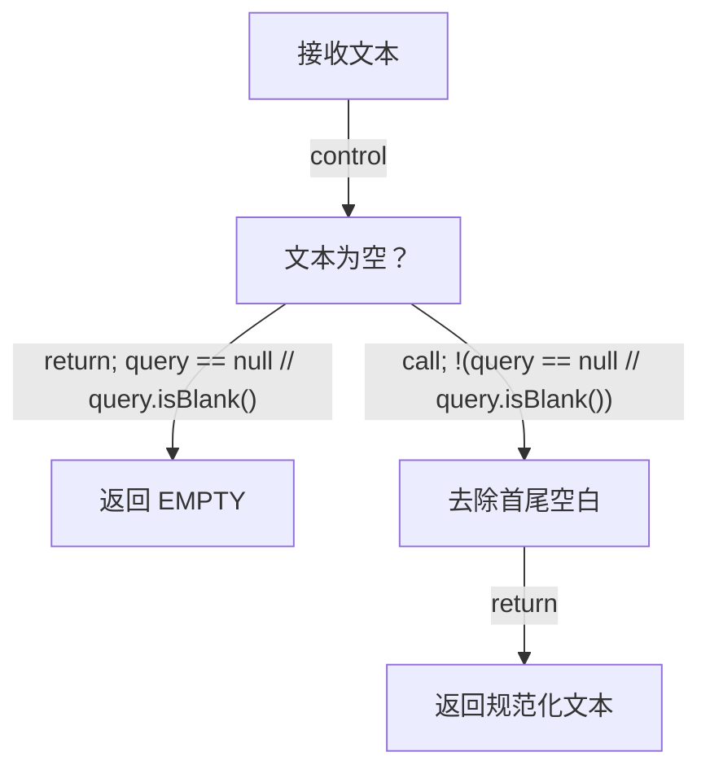

# 静态业务流程

箭头类型和条件以结构化图为准；调用关系不等于执行先后关系。

```mermaid
flowchart TD
  n1["接收文本"]
  n2["文本为空？"]
  n3["返回 EMPTY"]
  n4["去除首尾空白"]
  n5["返回规范化文本"]
  n1 -->|"control"| n2
  n2 -->|"return; query == null // query.isBlank()"| n3
  n2 -->|"call; !(query == null // query.isBlank())"| n4
  n4 -->|"return"| n5
```
