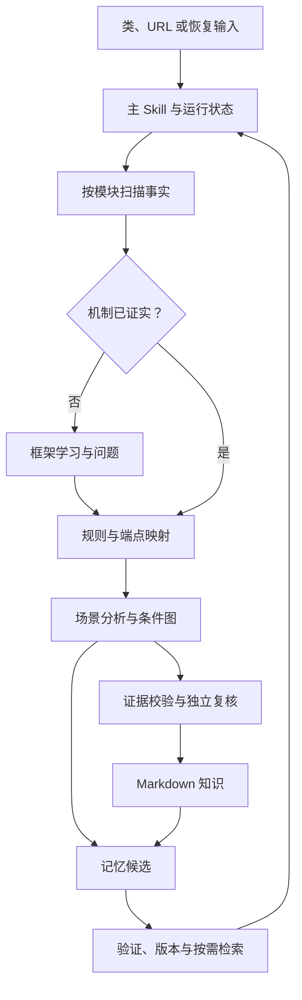

# 架构与执行设计

目标是形成可追溯的业务知识，而不是凭代码名称生成看似完整的调用链。确定性工具保存源事实、限制可执行规则并检查一致性；Agent 在有限范围内阅读实现、学习机制和解释业务；程序员解决无法证实的歧义。

## 组件和数据流

问题节点表示保留未决工作，不允许以候选机制自动推进到确认边。每个阶段都可存在部分已证实范围；最终覆盖状态单独报告。

| 组件 | 负责 | 不由它证明的内容 |
| --- | --- | --- |
| JavaParser / Symbol Solver | 源码结构、声明、调用位置、条件表达式、解析诊断 | 运行时 Bean 身份、动态调度、实际请求路径 |
| RPC 规则 DSL 与映射器 | 全限定注解、已验证提取规则、服务/schema/operation 匹配、修订冲突 | 未实现的框架语义、用户请求实际选择 |
| Run / Task 工具 | 归一输入、版本快照、领取、并发、结果与恢复 | 模型已读完代码、业务覆盖已经完整 |
| 场景 Skill | 按需展开、业务解释、条件和返回语义 | 没有证据的候选实现或领域含义 |
| Memory 工具 | 版本、时间、源指纹、索引与墓碑 | 记忆正文的业务语义自动正确 |
| Publisher | 图结构、引用、新鲜度及发布一致性 | Schema 合法就等于真实完整链路 |

## 工作区和目录治理

`.cac/skills/` 放 6 个 Skill 的短入口；`.cac/commands/` 放参数提示入口；`.cac/agents/` 放有限角色。工具发行内容进入 `docs/super-business-flow-tookit/`；工程配置与分析产物进入 `docs/super-business-flow/`。拆分按维护归属建立升级边界，两个目录均保留 `super-business-flow` 前缀。

工具根按用户指定保留 `tookit` 拼写；不新增同名 Skill。主 Skill 仍管理 `super-business-flow` 数据根，子 Skill 与其中 `frameworks/`、`mappings/`、`scenarios/`、`knowledge/`、`memory/` 的职责名称对应。

以下路径相对**工具根 `docs/super-business-flow-tookit/`**：

| 路径 | 内容 | 治理 |
| --- | --- | --- |
| `schemas/`、`templates/` | 格式约束与分类起点 | 随工具版本升级；不含编造的已验证事实 |
| `tools/` | Java CLI、测试和构建配置 | 不加入业务源码扫描；Maven 构建产物留在 `tools/target/` |
| `design/` | 工具需求、理由、契约和验收记录 | 与实现一同发布；旧验证仅证明对应旧提交 |
| `examples/` | 工具示例输入、固定夹具及说明 | 作为发行内容；重跑生成结果写入数据根或 run |
| `README.md`、`deployment.md` | 工具使用与部署说明 | 随工具版本更新 |

以下路径相对**数据根 `docs/super-business-flow/`**：

| 路径 | 内容 | 治理 |
| --- | --- | --- |
| `project/` | 仓库、模块、服务、调度及输出配置 | 显式注册，版本化 |
| `frameworks/<rpc-id>/` | 程序员输入、协议、规则、证据、样本、验证、问题、manifest | 一种机制独立治理 |
| `inventory/` | 按模块源事实、入口目录和诊断 | 可重建，携带快照 |
| `mappings/generated/` | 自动发现的候选与确认项 | 工具重建 |
| `mappings/endpoints/`、`overrides/` | 补充端点、带依据的修订 | 不被重扫覆盖 |
| `mappings/effective/` | 合并后生效视图 | 冲突和过时修订不能静默通过 |
| `scenarios/<id>/` | 输入、图、问题、覆盖 | 图与任务状态分离 |
| `knowledge/<id>/` | 开发者概述、图、时序、代码链接 | 版本化发布 |
| `memory/` | 当前条目、历史、索引和墓碑 | 工具管理时间和 revision |
| `evidence/` | 发布可复查的持久源证据 | 临时目录删除后仍可解释 |

项目根 `.temp/run/super-business-flow/<run-id>/` 保存冻结输入、任务结果、frontier、问题和恢复说明。它仍为临时运行状态目录，不受本次持久目录拆分影响。

首次安装交付两棵 `docs` 目录与 `.cac` 集成。常规升级只更新工具根及本工具的 `.cac` 文件，不覆盖数据根；模板只有在显式创建新文件时才作为起点。目录拆分保留清晰的文件职责，无需增加工具 Skill 或引入可配置根路径的间接层。[旧部署迁移](layout-migration.md)

模块 classpath 各自隔离；业务仓库独立定位，以 repo/module/service/symbol 标识关系。行号用于导航，不作为稳定身份。未提交源文件以内容指纹与持久证据保留，不生成指向旧提交的错误行链接。

## 主流程和上下文管理

先读取小型工作区配置与入口目录，再按入口/调用边展开源码。常驻上下文只保存目标、范围、阶段状态、有效版本和 frontier；详细 AST、原始源码、历史记忆与日志按需读取。

主 Skill 启动或恢复 run 后，读取任务列表，按当前依赖领取任务，实际完成 scan / frameworks / mappings / scenarios / knowledge 的工作，再提交结果。只有工具管理的领取状态与结果才参与调度；prompt 提示本身不能替代任务状态。[精确命令见运行契约](run-contract.md)。

工作量按“一个机制问题”“一个入口阶段”“有限 frontier”“一个可独立复核的结论”拆分。不要固定每个 repo 一个代理，否则跨服务问题容易被切断，也容易同时加载无关上下文。主代理决定拆分和合并，子代理不递归派发。

全运行的 `execution.max_parallel_tasks` 是共同上限，阶段限制可更低。调度器负责已领取任务的额度；宿主实际 Agent 的派发量也必须服从这个上限。上下文 token 限额由宿主/Agent 监测，Java CLI 不读取模型隐藏上下文。到达预算时提交 checkpoint 和下一步，开启新上下文继续，不能减少目标范围后宣布完成。

检索只加载相关记忆，并固定真正采用的版本。上下文压缩留下可重取的文件/符号引用、已完成范围、未完成边界和阻断问题；不把一次摘要变成源证据。按需检索、紧凑状态与隔离子代理的设计借鉴 Anthropic 的上下文工程实践，具体任务格式由本项目定义。[Anthropic 上下文工程](https://www.anthropic.com/engineering/effective-context-engineering-for-ai-agents)

## 任务包和合并边界

任务包放在被领取任务自己的输出目录，包含目标、入口/机制范围、排除项、固定 snapshot、读取的规则/映射/记忆版本、相关源引用、预算、完成和停止标准。规范起点见 [task/input.md](../templates/tasks/input.md)。

| 角色 | 最小输入 | 输出 |
| --- | --- | --- |
| `super-business-flow-mechanism-explorer` | 一个框架版本与具体待查机制、示例、依赖线索 | 语义结论、反例、原始证据、未决问题 |
| `super-business-flow-local-tracer` | 一个入口阶段或 frontier、模块事实与有效映射 | nodes/edges/conditions、业务解释、返回、覆盖与新 frontier |
| `super-business-flow-reviewer` | 原始需求和必要代码/规则/图 | 可复查的 pass / changes_required / inconclusive 意见 |

子代理只写自己的任务目录。主代理核对 snapshot、事实与证据、重复身份、冲突、覆盖，再发布 canonical 文件。任务 result 的精确机器字段以运行契约为准，业务产物由 [任务结果模板](../templates/tasks/analysis.md) 分文件组织。

独立复核给原始输入和必要产物，不提示作者的预期答案。不同代理重复同一结论不算独立证据。若宿主不具备 subagent 能力，可由同一 Agent 按任务包顺序执行并记录此限制；不得声称完成了独立复核。

## 框架学习协议

programmer 的示例首先进入 `input.md`，已知正例只是一个样本。依次定位实际 imports、注解定义、精确 Maven 版本、扫描/注册器、客户端代理、服务/schema/operation 选择、参数与返回适配及配置覆盖。缺少源码时请求该版本 sources，而不代用相似公开框架。

`protocol.md` 只保留对关联和分析有用的语义；`rules.yaml` 保存工具支持的有限 DSL；`manifest.yaml` 保存适用版本及能力状态；证据、问题、样本和独立验证分别保存。发现服务端无需实现接口、wrapper 接收字段、冒号服务串、重载/别名等行为时，必须指向实际证据。

验证至少包含独立已知调用对、框架测试或留出真实样本之一，并覆盖会误匹配的负例。无法取得独立依据时保持 candidate，询问缺失事实。规则的语义理解与 DSL 实现能力分别记录；工具不支持的策略不能以一个自由文本字段冒充已经执行。[规则契约](mapping-contract.md)

## 恢复、记忆和发布

长任务以磁盘 checkpoint 交接，记录版本、已完成和待续边界。这借鉴长运行 Agent 的持续进度文件和交接设计，运行器仍负责本项目具体的快照/失效化规则。[Anthropic 长运行 Agent 工程](https://www.anthropic.com/engineering/effective-harnesses-for-long-running-agents)

恢复使用冻结输入和有效配置；调度覆盖记入记录，语义来源变化重新验证或保守失效化。不能混合旧完成状态和新源码继续发布。任务图是调度 DAG，业务图允许递归和循环。

记忆先查源再使用；明确新证据可自动更正，未知变化标 stale，缺失仓库标 unavailable；两者不能直接得出原结论已错。删除默认墓碑保留历史。创建、内容更新时间、使用、验证、删除时间独立。[记忆契约](memory-contract.md)

发布前导入持久证据，校验源引用并在项目级短锁下发布。RPC/图/记忆各自保留权威位置，memory 只存可复用发现与索引，避免第二份事实相互漂移。[图与发布契约](publication-contract.md)

## 未来动态信息接入

静态节点、调用点、条件及证据保留稳定 ID，未来日志或 Trace 可引用它们，记录观测到的执行边、输入、耗时、结果和预期差异。观测缺失不能反证静态分支永不存在。badcase 分析应区分“实际执行偏离预期”和“静态图尚不完整”，再用可验证建议及效果反馈更新知识。
